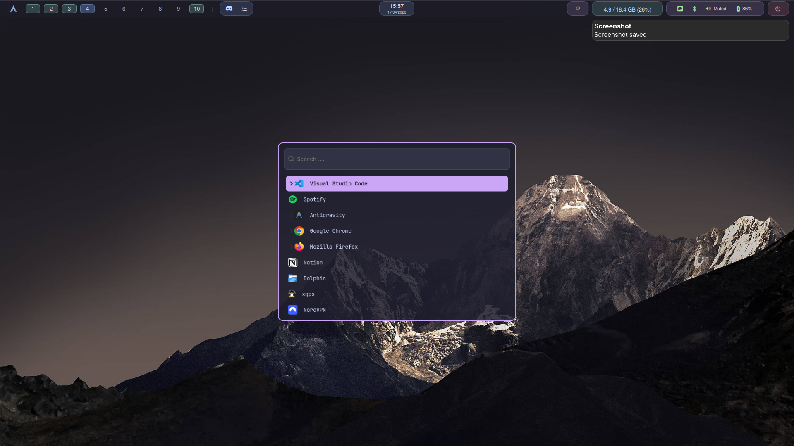
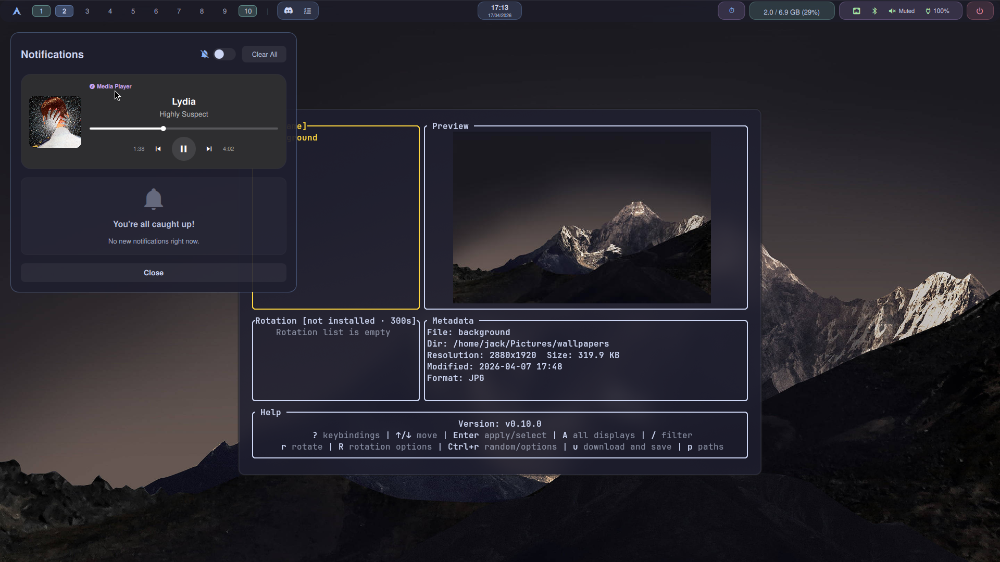
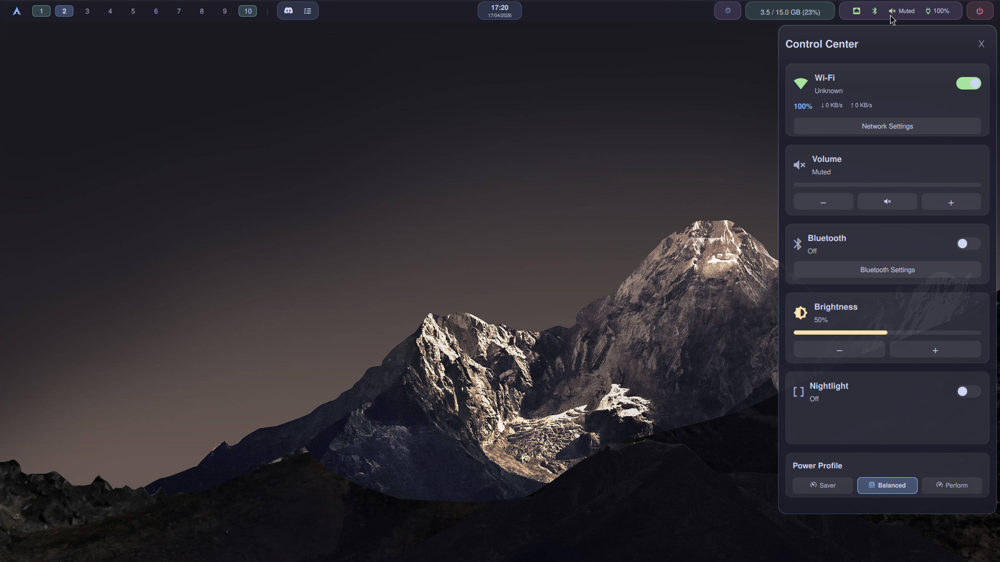
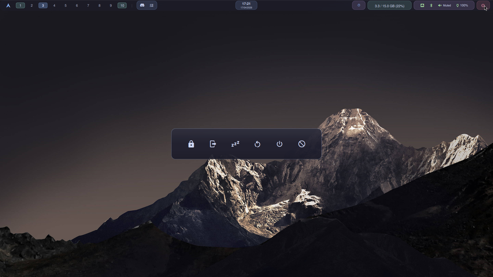
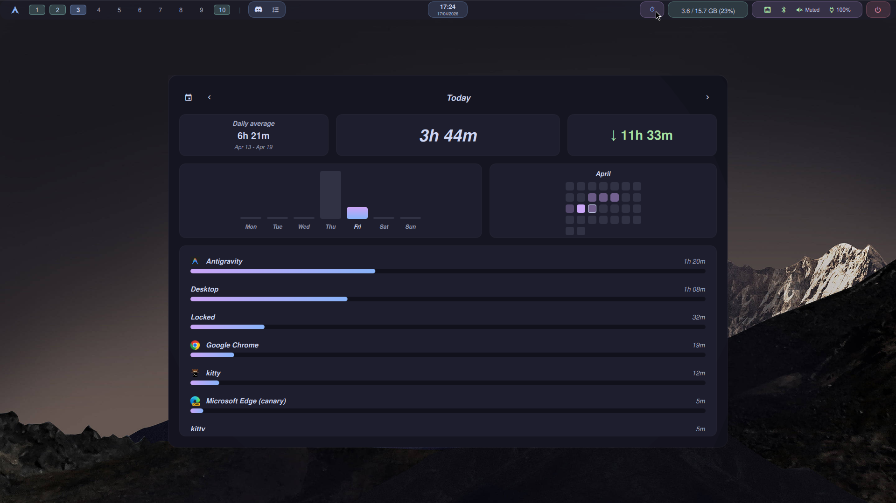
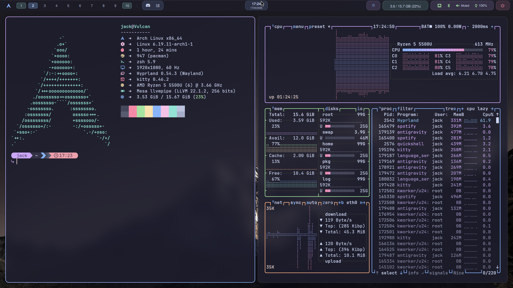
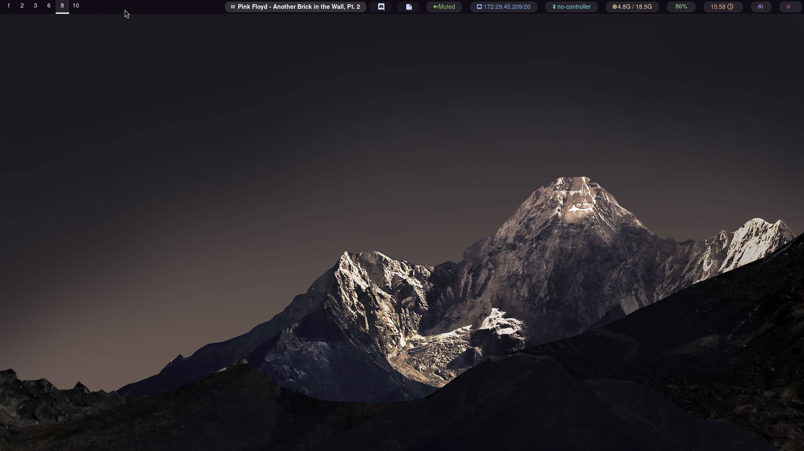

# Dotfiles

Two Hyprland shell configuration setups on Arch Linux, featuring two distinct shell/bar configurations: **Quickshell** and **Waybar**.

## Overview

This repository contains two shell configurations that can be used with Hyprland.

### Shell Options

1.  **Quickshell**: Includes integrated notifications, calendar, media controls, and a custom "Focus Time" productivity tracker.
2.  **Waybar**

## Quick Start

This repository is designed to be managed with [GNU Stow](https://www.gnu.org/software/stow/).

1.  **Clone the repository**:
    ```bash
    git clone https://github.com/<your-username>/dotfiles.git ~/dotfiles-public
    cd ~/dotfiles-public
    ```

2.  **Stow your preferred configuration**:
    ```bash
    # For Quickshell
    stow quickshell
    
    # For Waybar
    stow waybar
    
    # Stow other core components
    stow hypr kitty zsh btop fastfetch
    ```

## Components

- **Window Manager**: Hyprland
- **Terminal**: Kitty
- **Shell**: Zsh (with Starship prompt)
- **Launcher**: Wofi
- **Notifications**: Integrated (Quickshell) or Dunst/mako (standalone)
- **File Manager**: Lazygit (for git), Ranger/Yazi (recommended)

---

*Individual READMEs for Quickshell and Waybar can be found in their respective directories.*


## Images

 
 
 
 
 

